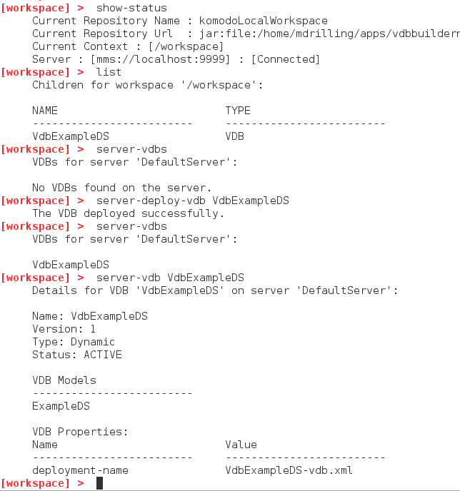

### Interact with server VDBs

This document shows a couple different ways you can interact with server VDBs:
* Deploy a VDB from your VDB Builder workspace to the connected server.
* Get a VDB from the connected server and store it in your VDB Builder workspace.

This opens up a lot of possibilites for VDB interactions.  For example you can deploy a new VDB created in VDB Builder to a running server.  Or, you could fetch a VDB from the connected server, then edit it and re-deploy it.

**NOTE:** Deployment of dynamic VDBs from VDB Builder is somewhat limited at this time.  VDB Validation in VDB Builder has not yet been implemented, so you are allowed to deploy 'invalid' VDBs.  Such an attempt will fail.  Also, a dynamic VDB will most likely reference other datasources.  If the datasources are not present on the server, the deployment will fail.  All of these issues will be addressed in the near future.

Note that in __VDB Builder__, you can use __tab completion__ to see the available commands options, or use __help commandName__ to see command details.

### Requirements

* Install VDB Builder cli - refer to the [Installation Instructions](install-cli.md) for details

### Deploy a VDB from VDB Builder to a server

You can deploy a VDB from VDB Builder to a running server.  The sample session below shows how to view the server and workspace VDBs, and deploy a workspace VDB to the running Server.

---
Here is a summary of the commands used for the above session:

* __`show-status`__ - display the shell status.  Note that the current server status is [Connected]
* __`list`__ - show all children in __workspace__.  Note that we have a VDB __VdbExampleDS__ in our workspace.
* __`server-vdbs`__ - show all VDBs on the connected server.  Note that there are no VDBs found on the server.
* __`server-deploy-vdb VdbExampleDS`__ - deploy __VdbExampleDS__ from VDB Builder to the connected server.
* __`server-vdbs`__ - again, show all VDBs on the connect server.  Note that __VdbExampleDS__ has been deployed!
* __`server-vdb VdbExampleDS`__ - show more detail for __VdbExampleDS__ on the connect server.

---

### Get a VDB from the server and store it in VDB Builder

You can also fetch a VDB from a running server and save it to the VDB Builder workspace.  The sample session below shows how to view the server VDBs and save a VDB into your VDB Builder workspace.

---
Here is a summary of the commands used for the above session:

* __`show-status`__ - display the shell status.  Note the current server status is [Connected]
* __`list`__ - show all children in __workspace__.  Note that we do not have any VDBs.
* __`server-vdbs`__ - show all VDBs on the connected server.  Note that __VdbExampleDS__ exists on the server. 
* __`server-get-vdb VdbExampleDS`__ - gets __VdbExampleDS__ from the connected server, and copies it to VDB Builder workspace.
* __`list`__ - show all children in __workspace__.  Note that __VdbExampleDS__ is now in the VDB Builder workspace!
* __`cd VdbExampleDS`__ - navigate into __VdbExampleDS__.
* __`show-summary`__ - shows a summary (properties and children) for the current context, __VdbExampleDS__

---
